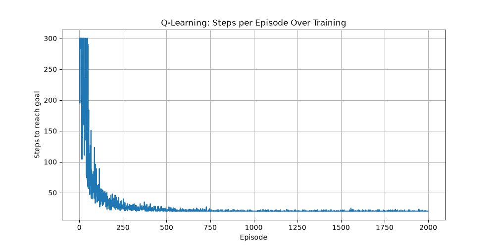
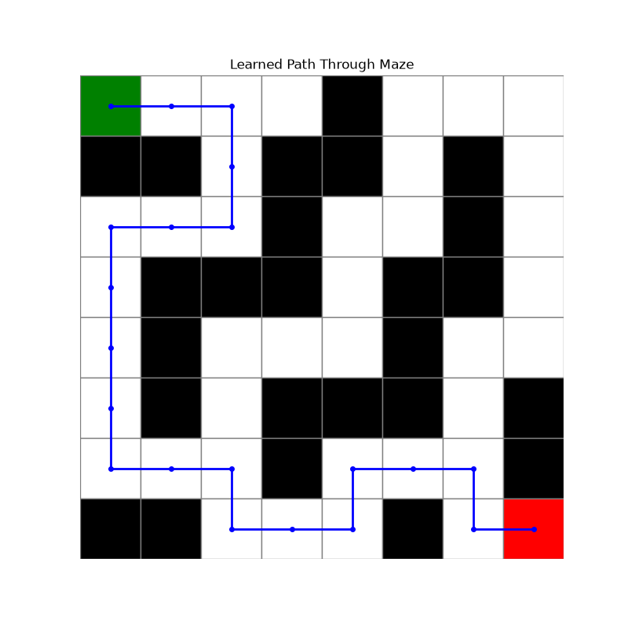

# Self-Learning AI Agent (Q-Learning)

A reinforcement learning agent that learns to navigate a grid maze entirely through trial and error — no path is ever hard-coded. Built from scratch in Python using the Q-learning algorithm, without any ML libraries beyond NumPy for array handling.

## How it works

- **Environment** (`environment/grid_world.py`): defines a 4x4 grid maze with walls, a start position, and a goal. Handles movement rules and rewards (+10 for reaching the goal, -1 per step to encourage shorter paths).
- **Agent** (`agent/q_learning_agent.py`): maintains a Q-table mapping every (position, action) pair to a learned value. Uses an epsilon-greedy strategy — balancing exploration (random moves) against exploitation (using learned knowledge) — with exploration decaying over time as the agent gains experience.
- **Training loop** (`main.py`): runs 500 episodes, each a fresh attempt from start to goal. After training, demonstrates the agent solving the maze using *only* its learned Q-table, with zero randomness.

## Results

- Episode 1: ~46-88 steps (mostly random wandering)
- Episode 500: 6 steps (optimal path)
- Final demonstration run reliably finds the shortest valid path around all walls

## Visualizations

Running `main.py` generates two images:
- `learning_curve.png` — steps-to-goal per episode, showing the agent's improvement from ~300 steps down to a stable 20-step optimal path
- `maze_path.png` — the maze layout with the agent's final learned path drawn on top

## Setup

\`\`\`bash
git clone https://github.com/Ronak07-cell/self-learning-ai-agent.git
cd self-learning-ai-agent
python3 -m venv venv
source venv/bin/activate
pip install -r requirements.txt
\`\`\`

## Usage

\`\`\`bash
python3 main.py
\`\`\`

## Tech Stack

- Python 3
- NumPy (Q-table storage and operations)
- Core algorithm: Q-learning (Bellman equation), no external RL libraries used

## What I learned

- The exploration vs. exploitation tradeoff, and why exploration must decay over time
- How the Bellman equation propagates reward information backward through a state space
- Debugging a real Python scoping bug where code was written outside the function that defined its variables
- Object-oriented design: separating environment logic from agent logic, mirroring how real RL frameworks (OpenAI Gym) are structured